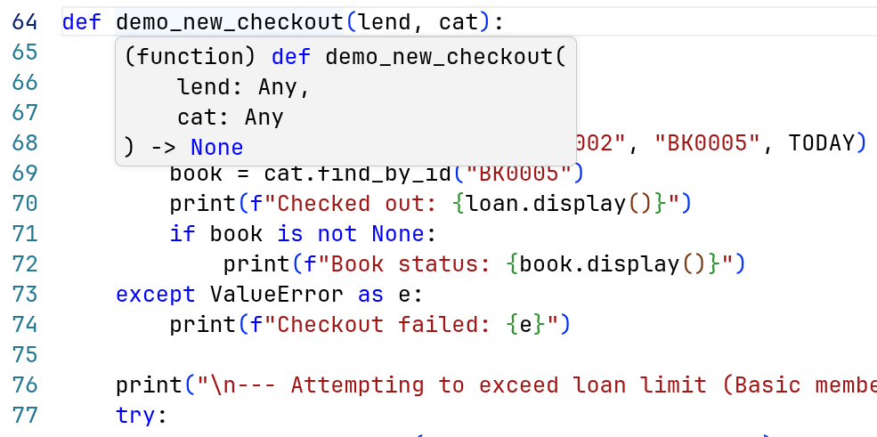
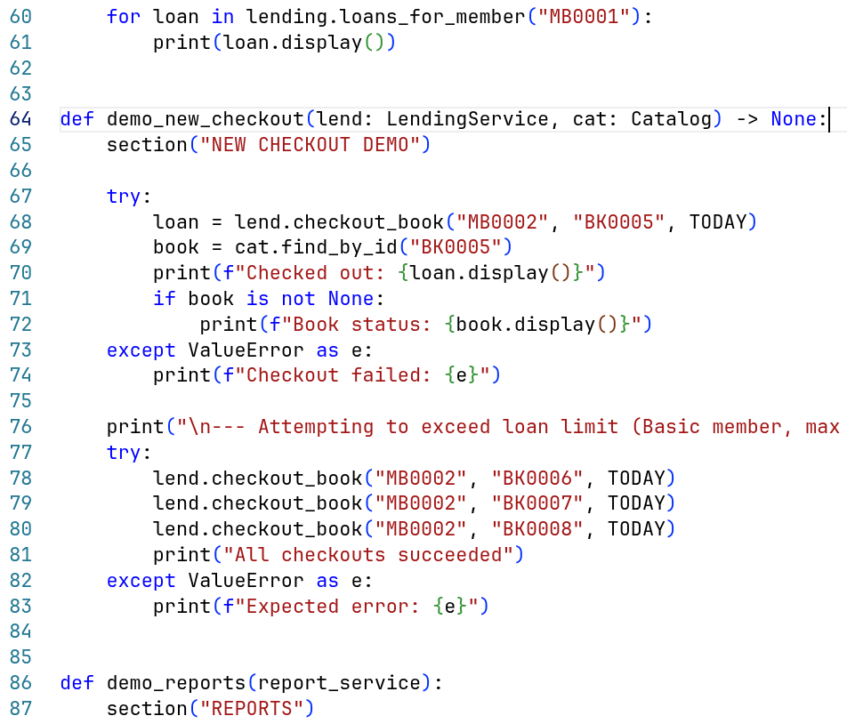
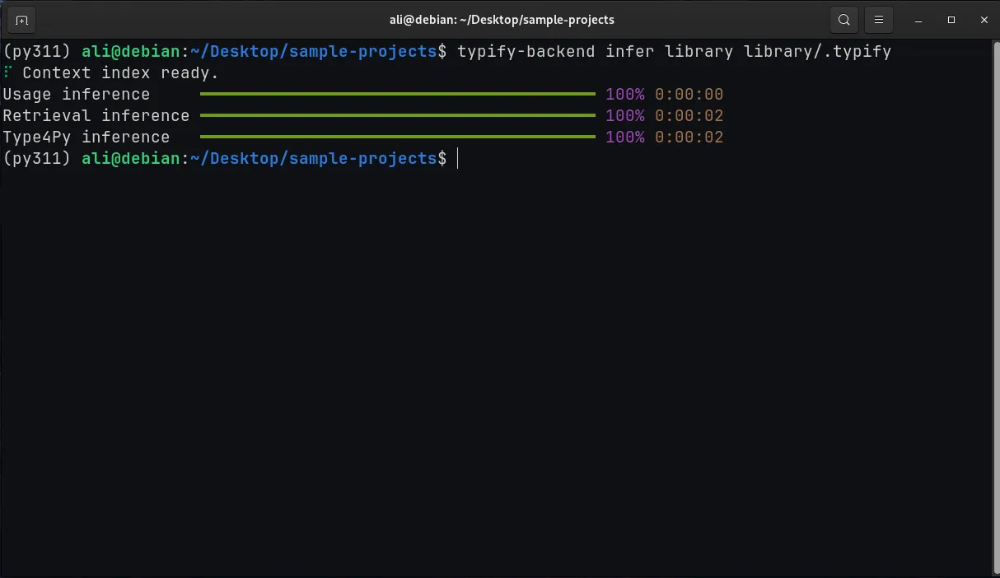
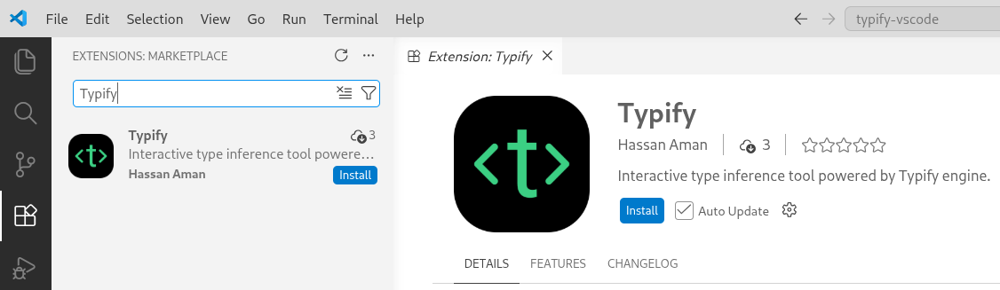
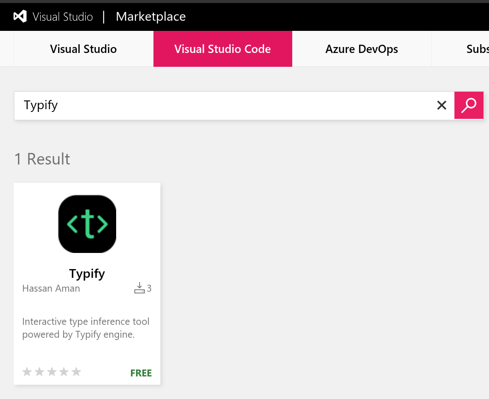
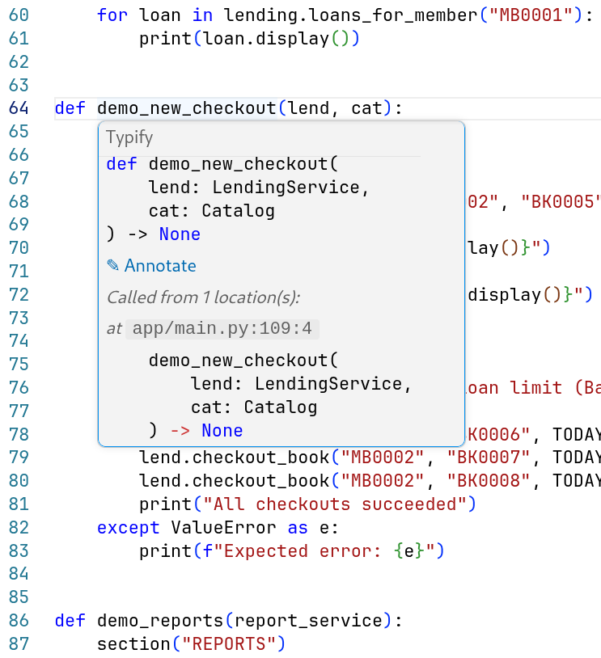
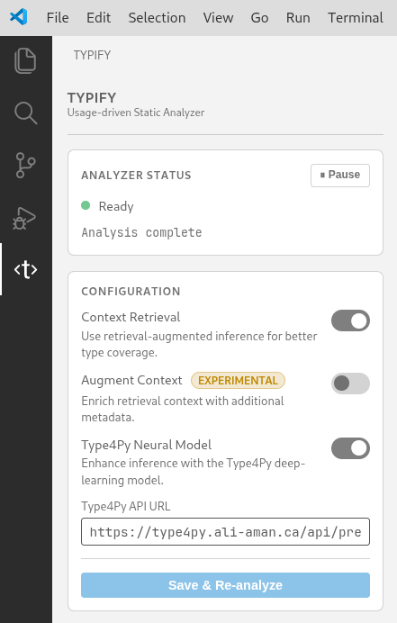

# Typify

**Typify** is a usage-driven Python type inference system that automatically infers types for unannotated Python codebases.

The project consists of two parts:

- **typify-cli** - the standalone inference engine and CLI powering the extension
- **Typify VS Code Extension** - interactive editor integration with live inferred types, hover cards, and one-click annotation

---

## Motivation

Python is one of the most widely used programming languages in the world, yet the vast majority of real-world Python code remains unannotated. Studies show that fewer than 10% of annotatable code elements carry explicit type annotations. This creates real problems for developers: without type information, IDEs cannot offer reliable autocompletion, refactoring tools operate blindly, and entire classes of bugs go undetected until runtime.

| Without annotations | With annotations |
|---|---|
|  |  |

Adding annotations manually is tedious and error-prone, especially in large or legacy codebases. The goal of Typify is to automate this process, recovering precise type information across an entire project without requiring developers to write a single annotation by hand.

---

## Approach

Typify is a purely static type inference engine. It builds a dependency graph of the entire project, schedules modules in topological order, and propagates type information across functions, classes, and module boundaries using iterative fixpoint analysis.

The core insight is **usage-driven inference**: types are inferred not from declarations, but from how variables and functions are actually used throughout the codebase.

### Example

Consider a function with no annotations:

```python
def add(x, y):
    return x + y
```

Somewhere else in the project, it is called like this:

```python
add(10, "hello")
```

Existing tools treat each function in isolation and cannot infer anything about `x` or `y` without explicit annotations. Typify traces the call site, observes that `10` is an `int` and `"hello"` is a `str`, and propagates these types back to the parameters, inferring `x: int` and `y: str` without any annotations.

This call-site propagation works recursively and cross-module, meaning types flow naturally through the entire project as Typify analyzes it.

Unlike local-only inference tools, Typify uses a **whole-project usage-driven analysis**. It tracks how values flow across files and function calls, allowing it to infer precise types such as:

```python
list[dict[str, list[str]]]
```

instead of broad approximations like `list` or `Any`.

---

## Evaluation

Typify was evaluated on two benchmark datasets, **ManyTypes4Py** and **Typilus**, against static checkers (Pyright, Pyre Infer), a deep learning model (Type4Py), and the state-of-the-art hybrid system (HiTyper).

Key findings:

- Typify substantially outperforms all static checkers, with exact-match accuracy up to **55.9%** overall on ManyTypes4Py vs. Pyre Infer's **10.4%**.
- Typify closely trails HiTyper despite using no machine learning, running at **4.7 ms per data point** vs. HiTyper's **48.2 ms**, a 90% reduction in latency.
- When combined with Type4Py, Typify **outperforms HiTyper** across nearly all tasks and datasets.

### Feature Comparison

| Tool | No annotations needed | Usage-driven inference | Cross-module / whole-project | Deterministic & reproducible | ML-based predictions |
|---|:---:|:---:|:---:|:---:|:---:|
| Pyright | ✕ | ✕ | ✓ | ✓ | ✕ |
| Pyre | ✕ | ✕ | ✕ | ✓ | ✕ |
| Type4Py | ✓ | ✕ | ✕ | ✕ | ✓ |
| HiTyper | ✓ | ✕ | ✕ | ✕ | ✓ |
| **Typify** | **✓** | **✓** | **✓** | **✓** | **✓** |

As shown above, Typify stands out because it combines analysis of the entire project with predictable execution, while also supporting optional ML features. Unlike many existing tools, it does not focus on just one strength at the expense of others.

---

# typify-cli

`typify-cli` is the standalone inference engine and CLI used by the VS Code extension. It can also be used independently for research, experimentation, batch analysis, and integration into custom tooling.

## Installation

Requires **Python 3.11 or higher**.

```bash
pip install typify-cli
```

### Dependencies

The following packages are installed automatically by the above command: `tantivy`, `rich`, `gdown`, and `requests`.

---

## How Typify Works

The analysis pipeline consists of several stages:

1. **Dependency graph construction** - builds a project-wide import graph and handles circular imports through fixpoint iteration.

2. **Usage-driven inference** - infers types from assignments, operators, method calls, and usage patterns. Types accumulate monotonically over time.

3. **Propagation passes** - re-applies inferred call-site information across multiple rounds, resolving increasingly deep call chains.

---

## Usage

### Inference

```bash
typify-cli infer <project_directory> <output_directory>
```

### Output Structure

The output directory contains:

```text
types/           # JSON type outputs per file
index.json       # Source-to-output mapping
config.json      # Analyzer configuration
context-index/   # Retrieval index
```



The generated output is designed to be consumed directly by the Typify VS Code extension.

Subsequent runs are incremental: only changed files are reprocessed by retrieval and Type4Py passes.

See [schema.md](schema.md) for the full output format.

---

## Configuration

On first run, Typify writes a default `config.json`:

```json
{
    "context-retrieval": true,
    "context-index-download": "<gdrive-url>",
    "retrieval-top-k": 5,
    "type4py": true,
    "type4py-api-url": "https://type4py.ali-aman.ca/api/predict?tc=0",
    "augment-context": false,
    "propagation-passes": 3,
    "symbolic-depth": 3
}
```

| Field                    | Description                         |
| ------------------------ | ----------------------------------- |
| `context-retrieval`      | Enable retrieval-based inference    |
| `context-index-download` | Retrieval index download URL        |
| `retrieval-top-k`        | Number of retrieved candidates      |
| `type4py`                | Enable Type4Py integration          |
| `type4py-api-url`        | Type4Py API endpoint                |
| `augment-context`        | Experimental retrieval augmentation |
| `propagation-passes`     | Number of propagation rounds        |
| `symbolic-depth`         | Symbolic execution recursion depth  |

For more details, refer to the [ICPC 2026 paper](https://doi.org/10.1145/3794763.3794825).

---

## Building a Custom Retrieval Index

Researchers can build their own retrieval indexes using:

```bash
typify-cli build <dataset_root> <index_directory> [--workers N]
```

Supported datasets include:

- ManyTypes4Py
- Typilus
- Any annotated Python corpus

This enables experimentation with domain-specific retrieval corpora.

---

## Batch Inference and Evaluation

For large-scale analysis across entire datasets, such as benchmarking Typify against a corpus of Python projects, `typify-cli` provides three commands that together form an end-to-end evaluation pipeline: ground-truth extraction, batch inference, and result comparison.

### `typify gt` - Ground-Truth Extraction

Extracts type annotations from an already-annotated dataset, producing a JSON file that serves as the reference ground truth for evaluation. Run this first on any dataset that contains existing annotations.

```bash
Usage: typify gt [DATASET_DIR] [--paths-txt PATHS_TXT] [--output-types OUTPUT_TYPES]

Arguments:
  DATASET_DIR PATH       Path to the dataset directory

Options:
  --output-types PATH    Output JSON file to write extracted annotations into
  --paths-txt PATH       Optional file listing specific relative paths to analyze
```

---

### `typify dataset` - Batch Inference

Runs Typify's inference engine over an entire dataset directory, processing each project and writing predicted types to a JSON output file. The `--topn` option controls how many ranked predictions to retain per slot, which is useful when evaluating Top-N accuracy.

```bash
Usage: typify dataset [DATASET_DIR] [OPTIONS]

Arguments:
  DATASET_DIR PATH       Path to the dataset directory

Options:
  --output-types PATH    Output JSON file for inferred type predictions
  --topn INTEGER         Number of top-ranked predictions to retain per slot
```

---

### `typify eval` - Evaluation

Compares Typify's predictions against the ground truth produced by `typify gt`, reporting accuracy using both exact-match and base-type matching. Supports Top-N evaluation to measure how often the correct type appears anywhere in the top N predictions.

```bash
Usage: typify eval [GT_PATH] [TOOL_PATH] [--topn N]

Arguments:
  GT_PATH PATH    Ground-truth JSON file produced by typify gt
  TOOL_PATH PATH  Inference output JSON file produced by typify dataset

Options:
  --topn INTEGER  Evaluate using Top-N predictions (default: 1)
```

---

# Typify Visual Studio Code Extension

The VS Code extension brings Typify directly into your editor. Open a Python project and Typify automatically analyzes your code in the background, showing inferred types on hover and letting you insert annotations into your source with a single click.

## Requirements

- VS Code 1.85 or higher

Typify sets itself up automatically on first launch. No extra installs are required.

---

## Installation

### From inside VS Code

1. Press `Ctrl+Shift+X` (Windows/Linux) or `Cmd+Shift+X` (Mac)
2. Search for **Typify**
3. Click **Install**



### From the Marketplace

Typify is also available on the [Visual Studio Code Marketplace](https://marketplace.visualstudio.com/items?itemName=amanh.typify).



Once installed, Typify activates automatically whenever you open a Python file. On the first run it creates a small isolated Python environment in the background. This only happens once.

---

## Features

### Live Type Inference

Typify continuously analyzes your project and infers:

- Variable types
- Function parameter types
- Function return types

The analysis updates automatically about one second after you stop typing, no save or manual run required.

---

### Hover Cards

Hover over any variable, parameter, function, or class to see:

- Inferred type information
- Full inferred function signatures
- Call sites across the project
- Scope information
- Definition locations



---

### One-Click Annotation

When Typify infers a type, an **Annotate** button appears in the hover card.

Clicking it inserts the annotation directly into your source code.

Supported annotations include:

- Function parameters
- Return types
- Variables


You can also annotate from the Command Palette using:

```text
Typify: Annotate Symbol
```

---

### Status Bar

The bottom-right status indicator shows Typify's current state:

| Appearance | Meaning           |
| ---------- | ----------------- |
| `○ Typify` | Idle              |
| `↻ Typify` | Analysis running  |
| `✓ Typify` | Analysis complete |
| `✕ Typify` | Error             |

Clicking the status item opens the Typify sidebar.


---

### Sidebar Panel

The Typify sidebar provides:

- Analyzer status
- Pause/resume controls
- Configuration options



Optional inference modes can be enabled individually or together:

#### Context Retrieval

Uses a retrieval index of annotated Python code to suggest types for unresolved symbols based on contextual similarity.

Useful for functions or variables with little or no usage evidence.

#### Augment Context *(experimental)*

Improves retrieval quality by incorporating additional surrounding project context into retrieval queries.

#### Type4Py Neural Model

Integrates the [Type4Py](https://github.com/saltudelft/type4py) deep-learning model as a fallback inference source for low-confidence slots.

This supplements, rather than replaces, Typify's usage-driven analysis.

---

## Commands

Available from the Command Palette:

| Command                      | Description                                   |
| ---------------------------- | --------------------------------------------- |
| `Typify: Show Panel`         | Open the Typify sidebar                       |
| `Typify: Re-analyze Project` | Run a fresh analysis                          |
| `Typify: Annotate Symbol`    | Insert annotation for the last hovered symbol |

---

## Tips

- No manual saves are required
- New Python files are detected automatically
- Deleted files are removed automatically
- Use **Re-analyze Project** if results appear stale
- Combining all optional modes gives the highest coverage

---

# Links

- [VS Code Marketplace](https://marketplace.visualstudio.com/items?itemName=amanh.typify)
- [VS Code Extension Repository](https://github.com/for-loop9/typify-vscode)
- [Typify Backend Repository](https://github.com/ali-aman-burki/typify-cli)
- [Type4Py](https://github.com/saltudelft/type4py)
- [ICPC 2026 Paper](https://doi.org/10.1145/3794763.3794825)

---
The full technical paper containing the technique description and evaluation results was published at the *34th IEEE/ACM International Conference on Program Comprehension (ICPC 2026)*, Rio de Janeiro, Brazil.

*Typify is a research project from the University of Windsor, supported by the Natural Sciences and Engineering Research Council of Canada (NSERC).*
